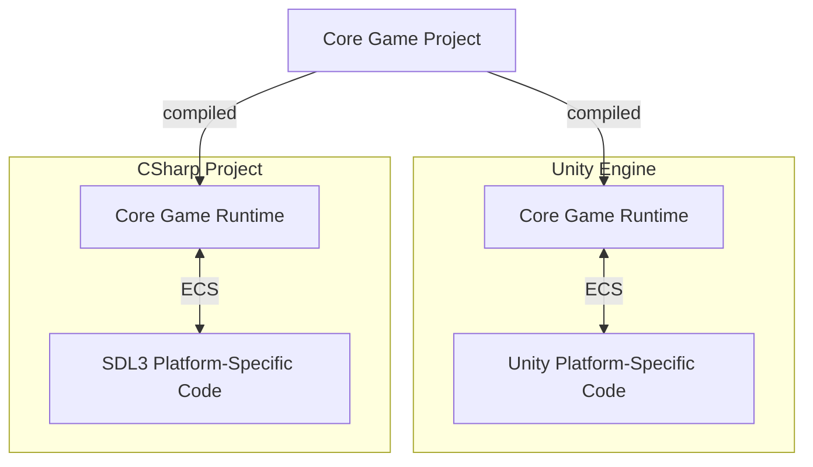

## Portable C# game runtime template

This project showcases how to use the same C# code for your game in multiple platforms.

The following platforms are implemented here:
- Unity
- SDL3

This allows you for instance to use SDL3 or a similar low level framework for Desktop platform.

And when porting to consoles you can use the Unity runtime as a host to your game runtime, making porting a bit more straightforward.

### Libraries
[Arch ECS](https://github.com/genaray/Arch) is used to architecture the project.

This is a very powerful and easy to use Entity Component System for C#, check it out!

## How this works
The [Game Project](Game/Game.csproj) is built as a Library.

This Library can be used in Unity, see the [Unity implementation](Unity%20Project/Assets/Unity%20Implementation/UnityModule.cs).

Or in a regular CSharp project, see the [SDL3 implementation](Unity%20Project/Assets/Unity%20Implementation/UnityModule.cs).

## Cool things on SDL3 target
### Hot reloading
Hot reloading comes out of the box, making it very satisfying to work on your systems:

### Native AOT
On SDL3 target, Native AOT is enabled when making a release build, this produces an easy to distribute self contained executable.