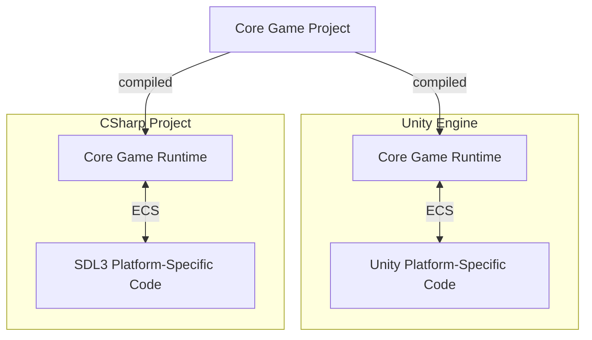

## 🚀 Portable C# Game Runtime Template

This project demonstrates how to use the **same C# code** for your game across multiple engines/frameworks.

Made to be used as a **template** for creating such portable projects.

### 🌍 Supported Platforms
- **Unity**
- **SDL3**

This allows you, for example, to:

- ✅ Use **SDL3** or similar low-level frameworks for desktop platforms.

- ✅ Utilize the **Unity runtime** as a host for your game runtime when porting to consoles, simplifying the porting process.

---

### 📚 Libraries
The project leverages [**Arch ECS**](https://github.com/genaray/Arch) for architecture design.

🧠 **Arch ECS** is a powerful and easy-to-use **Entity Component System** for C#. Highly recommended!

---

## 🛠️ How It Works

The [**Game Project**](Game/Game.csproj) is built as a **Library**.

This library can be used in:
- **Unity** — See the [Unity Implementation](Unity%20Project/Assets/Unity%20Implementation/UnityModule.cs)

https://github.com/user-attachments/assets/ac75e2b4-05b0-406b-86f1-3135a93a9e9d

- **Regular C# Project** — See the [SDL3 Implementation](Unity%20Project/Assets/Unity%20Implementation/UnityModule.cs)

https://github.com/user-attachments/assets/c5dfa5e5-c967-4aee-affe-41f95aeb44ae

## 🎯 Cool Features in the SDL3 Target

### 🔥 Hot Reloading
Hot reloading comes **out of the box**, making it incredibly satisfying to work on your systems:

https://github.com/user-attachments/assets/1a8642ad-f4db-4876-ab65-6f3962ab9ece

### ⚙️ Native AOT (Ahead of Time Compilation)
On SDL3 target, **Native AOT** is enabled in release builds.

It produces a self-contained executable for easier distribution.

---
